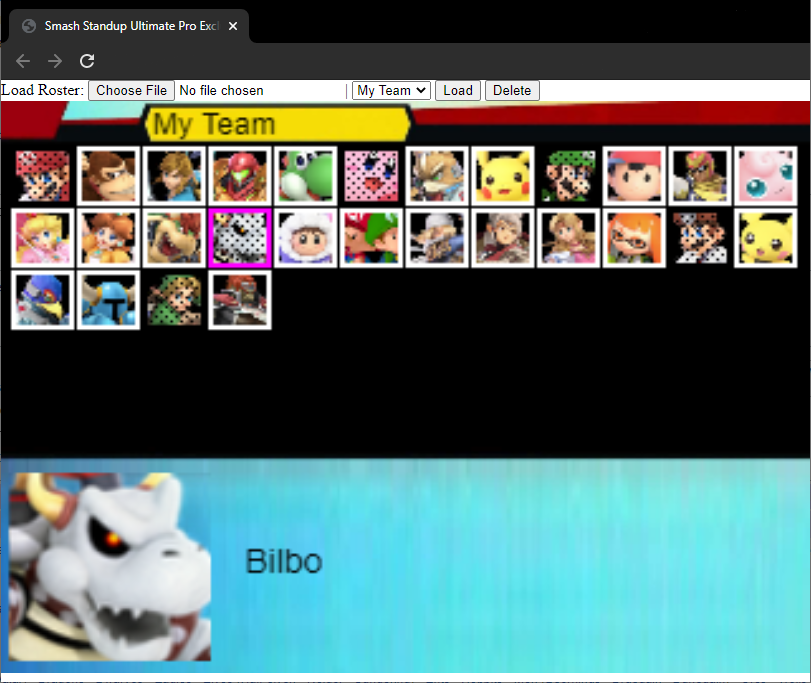

# Team Member Rando Picker
Team member picker, useful for stand-up. Low-res smash style.



## Usage
- Create a roster file (see roster creation below) as a template
- Choose the file in the file picker to install
    - Uses local cache within the browser. It retains after the session is over, but is unique to the name of the file in your OS or host (in most browsers.)
    - This roster will now be listed in the dropdown the next time you load the page or refresh, select it from the list and click "Load" button.
    - To delete the roster from cache, select the team name in the dropdown and click "Delete" button.
- Press the "Space" bar on your keyboard to stop the randomizer.
- Press "Space" again to restart it.
- Click with the mouse on an avatar to disable/enable the avatar.
    - This is useful for when team members are not present, you can deactivate them immediately.
- Refresh to reload/reset the picker.

## Roster file
The format is json, you can either use the built-in icons or supply your own.
A simple roster:
```json
{
    "teamName": "My Team",
    "roster": [
        { 
            "name": "Celebrimbor", 
            "img": 0 
        },{
            "name": "Earendil",
            "img": 1
        },{
            "name": "Elwing",
            "img": 2
        }
    ]
}
```
- `teamName` will be what is displayed in the dropdown.  
- `roster` is an array of members.   
- `name` is the team member's display name  
- `img` corresponds to the index in the avatar atlas.

## Advanced Roster / Custom Avatars
The built in avatars are for example only, you can use them or better yet, supply your own.  

### To add custom avatars:
- Take your avatars, make them a equally sized (60x60 pixels is default)
- Combine them into a single line image file
    - As an example, if the avatars are 60x60, image `0`'s top left corner would be at position `0,0` and image `1` would be a position `60x0` where coordinates are (x,y) and the top/left of the image file the origin. Image `2` would be at `120x0` and so on.
- Save as PNG or JPEG
- Base64 encode the file, ensure it starts with `data:image/jpeg;base64,`
- Paste the encoded text into your roster JSON as the `atlas` element:
```json
{
    "teamName": "My Team",
    "roster": [
        { 
            "name": "Celebrimbor", 
            "img": 0 
        },{
            "name": "Earendil",
            "img": 1
        },{
            "name": "Elwing",
            "img": 2
        }
    ],
    "atlas": "data:image/jpeg;base64,iVBORw0KGg..."
}
```
- Only 66 avatars are supported. To add more, see next section.

### Non-standard size avatars
For avatar's that are not 60x60, they must include details to scale the images. Also if you want more than 66 addressable avatars you need to supply this info.
```json
{
    "teamName": "My Team",
    "roster": [
        { 
            "name": "Celebrimbor", 
            "img": 0 
        },{
            "name": "Earendil",
            "img": 1
        },{
            "name": "Elwing",
            "img": 2
        }
    ],
    "atlas": "data:image/jpeg;base64,iVBORw0KGg...",
    "avatarDetails": {
        small: {
            w: 60, h: 60, scale: 2.4
        },
        large: {
            w: 80, h: 80
        },
        num: 66
    }
}
```
- `small`
    - `w` and `h` width and height of an individual image in the atlas (ex. 60x60)
        - Changing this modifies how images are cropped for display.
    - `scale` refers to scaling the image in the random selector window. The size of the image is divided by this number. 
        - 60 / 2.4 = 25, so the size of the avatar in the selection window will be 25x25
- `large` refers the width and height of the selected member at the bottom of the screen.
    - _Note: this is currently unimplemented and 80x80 cannot be changed._
- `num` denotes the number of avatars in the atlas.

### Changing Grid Size
The grid size is set to fit 12 per row at 25x25. This can be changed by setting the `maxLine`
```json
{
    "teamName": "My Team",
    "roster": [
        { 
            "name": "Celebrimbor", 
            "img": 0 
        },{
            "name": "Earendil",
            "img": 1
        },{
            "name": "Elwing",
            "img": 2
        }
    ],
    "gridDetails": {
        "maxLine": 5
    }
}
```
In the above example, this means that if you have a list of 10 team members, you will have two rows of 5 in the member selection display.

## Known Issues
1. Scaling of the window is sketchy. 
    - The addition of the roster loader was a last minute hack and needs work.
1. It will crash if you keep pressing space bar after everyone is picked.
1. The low resolution has the potential to make your eyes bleed.
1. Doesn't work on mobile or any device lacking a keyboard.